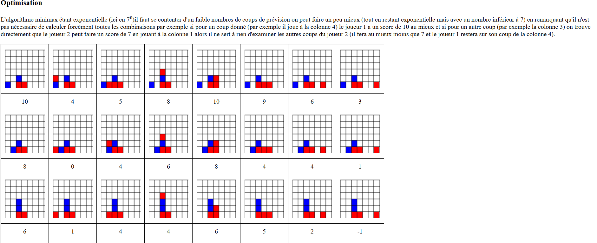

# 🎮 Puissance 4 avec L (IA avec Minimax)

Ce projet est une implémentation complète du jeu **Puissance 4** en
Python avec une interface graphique **Pygame** et une **IA optimisée**
utilisant l'algorithme **Minimax avec élagage alpha-bêta**.

L’algorithme explore l’arbre des possibilités (coup par coup) jusqu’à une certaine profondeur, puis il évalue les positions pour choisir le meilleur coup possible.

------------------------------------------------------------------------

## 🚀 Fonctionnalités

-   **Interface graphique interactive** avec Pygame.\
-   **Joueur 1 (humain)** joue avec les jetons **rouges**.\
-   **L (ordinateur)** joue avec les jetons **jaunes**.\
-   **IA optimisée** :
    -   Minimax avec élagage alpha-bêta.\
    -   Évaluation heuristique prenant en compte :
        -   L'occupation des colonnes centrales.\
        -   Les menaces (3 jetons alignés).\
        -   Le blocage des coups adverses.\
-   **Animation réaliste** : le jeton **tombe** dans la colonne jusqu'à
    la première case disponible.\
-   **Affichage du vainqueur** ou d'un match nul.\
-   **Profondeur de recherche configurable** (par défaut `4` coups).

------------------------------------------------------------------------

##  Structure du projet

    puissance4/
    │── game_logic.py   
    │── main.py         
    │── README.md    

------------------------------------------------------------------------

## Installation

1.  **Cloner le projet** (ou télécharger le dossier) :

    ``` bash
    git clone https://github.com/Raoly-chab/puissance4_IA.git
    cd puissance4_IA
    ```

2.  **Installer les dépendances** :

    ``` bash
    pip install pygame
    ```

3.  **Lancer le jeu** :

    ``` bash
    python3 main.py
    ```

------------------------------------------------------------------------

## Règles du jeu

-   Le but est d'aligner **4 jetons consécutifs** de sa couleur :
    -   Horizontalement\
    -   Verticalement\
    -   Diagonalement
-   Le joueur humain commence (jetons rouges).\
-   L'IA joue automatiquement après chaque coup du joueur.\
-   Si la grille est remplie sans vainqueur → **match nul**.

------------------------------------------------------------------------

## 🧠 IA (Minimax avec Alpha-Bêta)

L'IA explore l'arbre des coups possibles jusqu'à une certaine
**profondeur** (`L_DEPTH`), puis :\
- Elle **maximise ses chances de gagner**.\
- Elle **bloque les menaces adverses**.\
- Elle favorise les coups **au centre de la grille** (statistiquement
plus avantageux).



### Paramétrage :

Dans `game_logic.py`, tu peux modifier la profondeur de recherche :

``` python
L_DEPTH = 4
```

-   `L_DEPTH = 2` → IA rapide mais peu intelligente.\
-   `L_DEPTH = 4` → bon équilibre (par défaut).\
-   `L_DEPTH = 6+` → IA très forte mais plus lente.

------------------------------------------------------------------------


## 📸 Aperçu

interface.png
